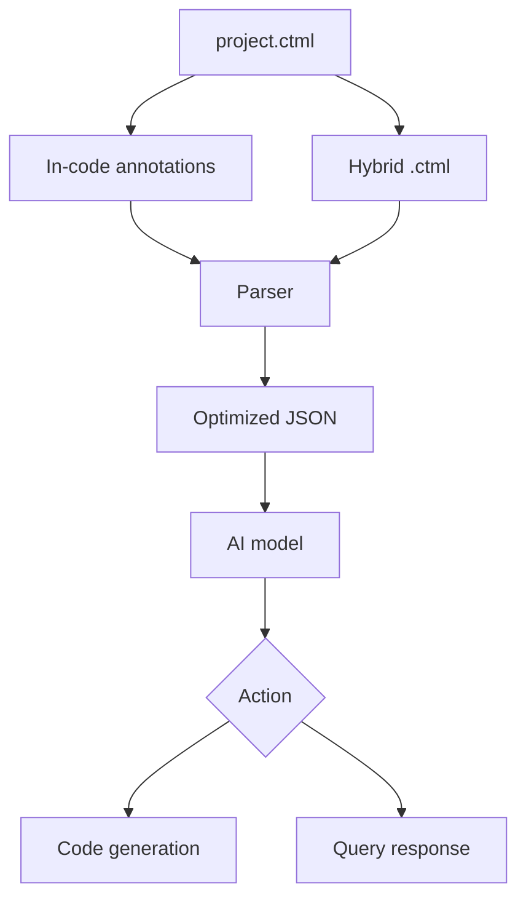
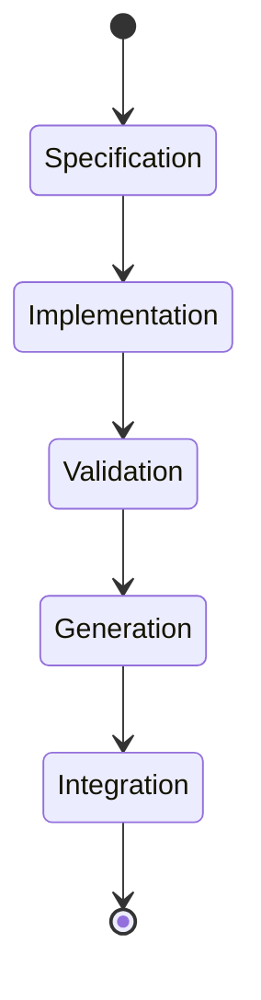

# AI Context DSL (Domain-Specific Language)  
## YAML-based DSL for AI-powered development: annotations, context binding, and code generation. Supports Python, JS, Rust, and other languages

## Keywords  
AI context binding, Domain-Specific Language, Code generation from annotations, Structured metadata for AI, Cross-language DSL

**AIContext DSL** is a YAML-compatible markup language for transferring structured context between developers and AI tools. Files use the `.ctml` extension.  

---

## Version 0.2: Key Features  
- **Code Generation**: Cross-language translation through hybrid files  
- **Extensibility**: Domain-specific extensions (finance, science, medicine)  
- **Validation**: Dependency and security checks  
- **Optimization**: Context compression for AI models  

---

## File Types in AIContext DSL  

| File Type          | Purpose                          | Use Cases              |  
|--------------------|----------------------------------|------------------------|  
| `project.ctml`     | Global project configuration     | Dependencies, AI settings |  
| Hybrid `.ctml`     | Code generation                  | Algorithms, components   |  
| In-code annotations| Context for existing implementations | Documentation, optimizations |  

---

## Workflow  


---

## Project Master File (project.ctml)  
* Contains a map of all entities (files, libraries, modules, tasks, documents)  
* Captures relationships between system elements  
* Example:  
  ```yaml  
  project:  
    name: "my_project"  
    version: "0.1.0"  
    dependencies:  
      python: "3.10"  
  ```  

---

## Code Generation  
Hybrid `.ctml` files enable idiomatic code generation for multiple languages:  

```yaml  
@aicontextdsl:  
  @codegen:  
    id: "optimized-quicksort"  
    target: ["rust", "go", "typescript"]  
    logic:  
      - step: "Array partitioning"  
        vars: ["i", "j"]  
    optimizations:  
      - name: "Median-of-three"  
```  

### @codegen Parameters  
| Parameter      | Required | Description                   |  
|----------------|----------|-------------------------------|  
| `id`           | Yes      | Unique component identifier   |  
| `target`       | Yes      | Target generation languages   |  
| `logic`        | Yes      | Algorithm description         |  
| `params`       | No       | Function parameters           |  
| `optimizations`| No       | Optimization list             |  

**Generation features**:  
- Automatic paradigm adaptation (indexes → slices)  
- Generic type inference  
- Cross-language optimization preservation  

---

## Context Annotations  
* Embed labels directly in source code files  
* Bind semantic descriptions to specific entities  
* Example:  
  ```python  
  # @aicontextdsl {  
  #   @manual {   
  #     id: "auth",  
  #     hint: "JWT authentication"   
  #   }  
  # }  
  ```  

---

## Practical Applications  
* Persistent context for AI tool interactions  
- Automated dependency documentation  
- Architectural decision tracking and tech debt management  

---

## AIContext Lifecycle  


---

## Specification Modification Rules  
Official specification modifications are exclusively reserved for the project owner. Community members can propose changes through:  
1. Issues - for proposal discussions  
2. Pull Requests - for implementation changes in `aicontext-compiler`  

---

## Project Development  
The project is under active development. Current specification version: **0.2**. Collaboration welcome:  

Contact:  
Nikolay Zhelannikov  
zhelannikov.n.a@gmail.com