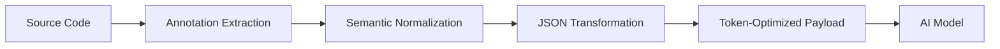

# AI Context DSL (Domain-Specific Language) Specification v0.2

## YAML-based DSL for AI-powered development: annotations, context binding, and code generation. Supports Python, JS, Rust, and other languages

## Purpose
A unified standard for transferring context to AI tools in development.

AIContext DSL combines three concepts:

1. **`@` Annotation Standard**  
Familiar to developers from Javadoc/TSDoc ecosystems

2. **YAML Flexibility**  
Supports complex nested structures unlike flat key-value pairs

3. **In-Code Embedding**  
Works within comments of any programming language

This trifecta enables what no other solution offers:  
**Structured, language-agnostic, AI-optimized metadata

## Format
YAML-compatible syntax, .ctml files.

## Structure of the Specification
### Global Project Configuration (project.ctml)
```
project:
  name: string              # Project name (mandatory)
  version: SemVer           # Specification version (mandatory)
  context_strategy:
    max_files: integer      # Maximum number of files in prompt (default: 7)
    priority: [string]      # Priority order: ["critical", "depends_on", ...]

dependencies:
  python: "3.10"            # Programming language versions
  nodejs: "18.17"

libraries:
  -
    name: "pydantic"
    version: "2.6.4"
    stability: "prod"       # Stability levels: prod/test/dev
    update_policy: "patch"  # Update policy: patch/minor/major/none

global:
  encoding: "utf-8"          # File encoding
  line_endings: "unix"      # Line endings: win/unix/mac
```

### Files Configuration (files)
```
files:
  - path: string                # Path to file (mandatory)
    type: string                # Type: python/markdown/config/jupyter (mandatory)
    version: SemVer             # File version
    status: string              # Status: active/legacy/deprecated
    critical: boolean           # Criticality for operation
```
### AI Context Information
```
    ai_hint: string             # Description of purpose (e.g., "JWT authentication")
    tags: [string]              # Categories: ["security", "payment", "legacy"]
```
### Dependencies
```
    depends_on:                 # Hard dependencies
      hard: [string]            # Required file paths (e.g., ["crypto.py"])
      soft: [string]            # Optional references (e.g., ["docs/api.md"])
    circular: false             # Prevent cyclic dependencies
```
### Security
```
    security:
      level: "high"             # Levels: critical/high/medium/low
      standards: ["OWASP ASVS"] # Standards followed
      threat_model:             # Risks & mitigations
        - risk: "Spoofing"
          mitigation: "HMAC-256"
```

### Performance
```
    performance:
      avg_execution_time: "250ms"
      bottlenecks: [string]     # Bottleneck areas (e.g., ["calculate_stats() (CPU-bound)"])
```

### Semantic Hints (Optional)
```
    semantic_hints:
      algorithms: 
        - name: "secure_hash"
          complexity: "O(n^2)"
      tech_debt: 
        - location: "lines 45-60"
          reason: "Outdated AES-128 algorithm"
```

## Advanced Features
### Grouping Context
```
context_groups:
  auth_flow:
    name: "Authentication Workflow"
    files: ["src/auth/controller.py", ...]
    shared_context:             # Shared parameters for group
      security_level: "high"
```
### Templates for Repeated Tasks
```
templates:
  db_model:
    ai_hint: "Database model using SQLAlchemy"
    links: ["docs/db_schema.md"]
```
### Environment Variables Mapping
```
env_mapping:
  database_url: 
    dev: "postgres://localhost:5432/dev"
    prod: "postgres://prod-db:5432/prod"

### Language	Syntax
```
* Python: # @aicontextdsl { }
* JavaScript: // @aicontextdsl { }
* Markdown: <!-- @aicontextdsl { } -->
* Java: /* @aicontextdsl { } */
* TypeScript: // @aicontextdsl { }
* YAML: # @aicontextdsl { }
* JSON: // @aicontextdsl { }
* TOML: # @aicontextdsl { }
* XML: <!-- @aicontextdsl { } -->
* HTML/CSS: <!-- @aicontextdsl { } -->
* Jupyter Notebooks: # @aicontextdsl { }
* Shell scripts: # @aicontextdsl { }
* SQL queries: -- @aicontextdsl { }
* Dockerfiles: # @aicontextdsl { }
* Text documents: # @aicontextdsl { }
* GraphQL schemas: # @aicontextdsl { }
* Protocol buffers: // @aicontextdsl { }
* R scripts: # @aicontextdsl:
* Package lock files: // @aicontextdsl { }
* C++ source code: // @aicontextdsl { }
* Rust programs: // @aicontextdsl { }
* Go applications: // @aicontextdsl { }
* Kotlin classes: // @aicontextdsl { }
* Swift projects: // @aicontextdsl { }
* Binary data: # @aicontextdsl { }
* Comma-separated values: # @aicontextdsl { }
* INI configurations: ; @aicontextdsl { }
* General configuration files: # @aicontextdsl { }
```
## Validation Rules
* All referenced paths in depends_on must exist.
* The version field must conform to SemVer rules.
* Critical files cannot depend on deprecated modules.
* Cyclic dependencies are forbidden.

## Cycle Dependency Check
The system is required to monitor the presence of cyclic dependencies between files and prevent their creation. If a cyclic dependency is detected, an error message should be displayed.

## Non-Critical Module Control
If a critical file depends on an outdated component (module), the system must issue a warning or error indicating the need to update dependencies. It is recommended to regularly check the version of dependencies and promptly update components to the current version.

## Support for International Encoding Standards
The project must support different international file encoding standards such as UTF-8 and UTF-16. Developers can choose the appropriate encoding standard for their specific project by specifying it in the configuration file (project.ctml).

The recommended default encoding format is UTF-8 because it is widely used and compatible with most modern platforms and services.

```

## Extension System and Customization

AIContext DSL supports two types of extensions to adapt to various domains and project needs:

### 1. Domain-Specific Extensions
**Purpose**: Create specialized annotations for specific domains:
- Finance (banking operations, accounting)
- Scientific computing (physics, chemistry, bioinformatics)
- Healthcare (HL7, DICOM standards)
- Game development (game logic, engine physics)

**Implementation**:
1. Create extension files with `.ctml` extension (e.g., `finance.ctml`)
2. Declare them in the main `project.ctml` file:
```
project:
  extensions: ["finance.ctml", "bioinformatics.ctml"]
```
### Financial extension example (finance.ctml)
```
# Financial domain extension
name: "Financial Domain Extension"
version: "1.2"

# Specialized tags
tags:
  - "transaction"
  - "compliance"
  - "audit_trail"

# Custom annotation blocks
custom_blocks:
  financial_entity:
    description: "Financial entity description"
    fields:
      entity_type: 
        type: "string"
        enum: ["asset", "liability", "equity"]
      currency: "ISO 4217 code"
      amount: "decimal"

# Operation templates
templates:
  money_transfer:
    intent: "Funds transfer between accounts"
    error_cases:
      - "Insufficient balance"
      - "Invalid recipient account"
```

### Scientific extension example (chemistry.ctml):
```
# Chemistry calculations extension
name: "Chemistry Extension"
version: "0.9"

custom_blocks:
  chemical_reaction:
    description: "Chemical reaction description"
    fields:
      reactants: "array<compound>"
      products: "array<compound>"
      conditions:
        temperature: "kelvin"
        pressure: "atm"
        catalyst: "string"

# Specialized data types
data_types:
  compound:
    structure:
      formula: "string"
      molar_mass: "g/mol"
      state: ["solid", "liquid", "gas"]
```
### Custom Extensions (Open Schema)
Principle: AIContext DSL follows an "open schema" model where:
* Core specification is strictly defined
* Implementations can add arbitrary elements
Core Requirements (immutable)
Every annotation MUST include:
* Root tag @aicontextdsl
* id field (string)
* version field (string)
```
# Minimal valid annotation
@aicontextdsl {
  id: "required-field"
  version: "1.0"
}
```
### Extensible Areas
Users MAY add:
* Custom top-level blocks:
```
@aicontextdsl {
  # Standard blocks
  @manual: {...}
  
  # Custom block
  deployment_settings: {
    region: "eu-west-1"
    replicas: 3
  }
}
```
* Additional fields in existing blocks:
```
@aicontextdsl {
  @manual {
    # Standard fields
    id: "auth"
    
    # Custom field
    compliance_standard: "PCI DSS 4.0"
  }
}
```
* Arbitrary values (where type isn't constrained):
```
@aicontextdsl {
  @ai_config {
    # Custom parameter
    custom_threshold: 0.85
  }
}
```
### Best Practices for Extensions
* Prefix custom fields:
```
# Recommended approach
x-audit-trail: true
org-custom-param: "value"
```
* Document extensions:
Create aicontext-extensions.md in project root
Describe all custom elements:
```
## Financial Extensions
**compliance_standard** (in @manual block)
- Type: string
- Description: Compliance with financial standards
- Valid values: PCI DSS, GDPR, SOX
```
* Avoid conflicts:
Don't use reserved names (id, version, source)
Monitor changes in core specification

### Limitations and Prohibitions
* Base syntax is immutable:
```
# INVALID: Changing @ symbol
$aicontextdsl { ... }  # Error!
```
* Core field types are fixed:
```
# INVALID: Changing id type
@aicontextdsl {
  id: 123  # Must be string!
}
```
* Block hierarchy is preserved:
```
# INVALID: @manual outside @aicontextdsl
@manual { ... }  # Error!
```


## In-File Annotations
An important feature of AIContext DSL is its ability to add internal annotations directly inside individual files. These annotations provide additional metadata that helps both developers and automated systems understand the purpose, structure, and relationships within the project.
Annotations come in two forms: manual and automatic.

### Manual Annotations
Manual annotations are created explicitly by developers themselves. They represent deliberate decisions about the code or content and serve several purposes:
* Provide clear instructions for AI interpreters.
* Highlight key functionalities or risks associated with certain sections of the code.
* Tag files or parts of them into categories for easier filtering.

**Basic Syntax:**
```
# @aicontextdsl {
#   @manual {
#     id: "auth-flow-annotation"
#     hint: "JWT authentication flow implementation"
#     tags: ["security", "authentication"]
#   }
# }
```
Each annotation includes:
* id: Unique identifier.
* hint: Human-readable description of the annotation’s intent.
* tags: List of categorization labels applied to the annotated section.
### Advanced Blocks for Manual Annotations
### @intent - Purpose and Goals
Block for explicitly describing objectives and business logic:
**Basic Syntax:**
```
# @aicontextdsl {
#   @manual {
#     @intent {
#       purpose: "User authentication via JWT"
#       business_value: "Secure system access"
#       expected_behavior: "Token generation with valid credentials"
#       dependencies: ["user_db", "redis_session"]
#       version: "2.3"
#       author: "security_team@company.com"
#       last_updated: "2025-03-15"
#       compliance: ["GDPR", "ISO27001"]
#       performance: "high"
#       test_coverage: "85%"
#     }
#   }
# }
```
### @error_cases - Error Handling
Block for describing potential error scenarios:
**Basic Syntax:**
```
# @aicontextdsl {
#   @manual {
#     @error_cases {
#       invalid_credentials: "Incorrect username or password"
#       token_expired: "Token has expired"
#       db_failure: "Database connection error"
#       rate_limit: "Request limit exceeded"
#       insecure_connection: "HTTPS connection required"
#       invalid_token_format: "Malformed token"
#       missing_scope: "Insufficient permissions"
#       brute_force_attempt: "Detected brute force attack"
#       user_inactive: "Account inactive"
#       system_time_skew: "Server time mismatch"
#     }
#   }
# }
```
### Automatic Annotations
Automatic annotations are generated programmatically by parsers or other tools based on analysis of the file contents. They help supplement information automatically without requiring explicit developer intervention but may not always reflect accurate user intentions fully.

Common use cases:
* Detecting performance bottlenecks
* Identifying unused imports
* Flagging obsolete functionality


**Basic Syntax:**
```
# @aicontextdsl {
#   @automatic {
#     id: "perf-bottleneck-123"
#     hint: "Potential slowdown due to nested loops"
#     source: "PerformanceAnalyzer-v2.1"
#     confidence: 0.92
#     severity: "medium"
#   }
# }
```
Additional fields:
* Source: Generating tool (linter, analyzer)
* Confidence: Certainty level (0.0-1.0)
* Severity: Impact level (low/medium/high)

### @ai_config Block - AI Configuration
Global settings for AI assistant interactions:
**Basic Syntax:**
```
# @aicontextdsl {
#   @ai_config {
#     token_optimization: "aggressive"
#     context_strategy: "prioritized"
#     focus: ["security", "error_handling"]
#     ignore: ["deprecated", "legacy"]
#     model: "gpt-4-turbo"
#     max_context_tokens: 12000
#     temperature: 0.3
#     response_format: "code_only"
#     allow_inline_comments: false
#     strict_validation: true
#   }
# }
```

### Difference Between Manual and Automatic Annotations

* Priority: Manual annotations always override automatic ones when conflicts arise.
* Editable: Only manual annotations can be edited freely by developers. Automated annotations will only change through re-analysis unless specifically modified manually.
* Usage Scenarios: Use manual annotations for critical contexts or essential points you want highlighted. Use automatic annotations for general insights derived by tools during static analysis.

### Combined Annotation Example

**Basic Syntax:**
```
# @aicontextdsl {
#   @manual {
#     id: "auth-flow-annotation"
#     hint: "JWT Authentication flow implementation"
#     tags: ["security", "authentication"]
    
#     @intent {
#       purpose: "Аутентификация пользователя через JWT",
#       business_value: "Обеспечение безопасного доступа к системе",
#       expected_behavior: "Генерация токена при валидных учетных данных",
#       dependencies: ["user_db", "redis_session"],
#       version: "2.3",
#       author: "security_team@company.com",
#       last_updated: "2025-03-15",
#       compliance: ["GDPR", "ISO27001"],
#       performance: "high",
#       test_coverage: "85%"
#     }
    
#     @error_cases {
#       invalid_credentials: "Неверный логин или пароль",
#       token_expired: "Срок действия токена истек",
#       db_failure: "Ошибка подключения к базе данных",
#       rate_limit: "Превышено количество попыток",
#       insecure_connection: "Попытка подключения без HTTPS",
#       invalid_token_format: "Некорректный формат токена",
#       missing_scope: "Недостаточно прав доступа",
#       brute_force_attempt: "Обнаружена атака перебором",
#       user_inactive: "Учетная запись неактивна",
#       system_time_skew: "Расхождение времени сервера"
#     }
#   }
  
#   @automatic {
#     id: "perf-issue-7f3a",
#     hint: "Potential slowdown due to nested loops",
#     source: "PerformanceAnalyzer v3.1",
#     confidence: 0.92,
#     severity: "medium",
#     detected_issue: "Отсутствует кеширование проверки токена",
#     suggested_fix: "Добавить кеширование в Redis на 5 минут",
#     impact: "Увеличивает нагрузку на БД на 40%",
#     priority: "P2",
#     tags: ["performance", "optimization"]
#   }
  
#   @ai_config {
#     token_optimization: "aggressive",
#     context_strategy: "prioritized",
#     focus: ["security", "error_handling"],
#     ignore: ["deprecated", "legacy"],
#     model: "gpt-4-turbo",
#     max_context_tokens: 12000,
#     temperature: 0.3,
#     response_format: "code_only",
#     allow_inline_comments: false,
#     strict_validation: true
#   }
# }
```
### Recommendations
* For critical logic:
  * Always use manual annotations with @intent and @error_cases blocks
  * Explicitly state security requirements in @intent
  * Regularly update annotations when code changes
* For automatic annotations:
  * Set retention policies (e.g., auto-delete after 30 days)
  * Filter by confidence level (e.g., confidence > 0.8)
  * Combine with manual annotations for comprehensive coverage
* AI optimization:
  * Use @ai_config to manage context size
  * Prioritize important topics through focus
  * Exclude irrelevant sections via ignore
  * Experiment with temperature for creativity/accuracy balance
* Best practices:
  * Start with basic annotations (id, hint, tags)
  * Gradually add specialized blocks
  * Maintain consistent tagging conventions
  * Review annotations during code reviews
  * Integrate annotation generation into CI/CD pipelines

Developers should primarily rely on manual annotations for high-level guidance, while automatic annotations complement these by providing deeper insights into less obvious patterns.

## Annotation Processing for AI Context
While the human-readable YAML-like syntax is optimal for developer experience, it consumes excessive tokens when sent directly to AI models. To optimize token usage while preserving semantic richness, AIContext DSL includes an automatic transformation process.

### The Token Optimization Challenge
1. **Problem**: Raw annotation format contains redundant elements:
   - Comment symbols (`#`)
   - Formatting whitespace
   - Repeated keywords
   - Structural syntax characters (`{`, `}`, `:`)
   
2. **Impact**: 
   - 40-60% token overhead in raw format
   - Reduced effective context window for AI
   - Higher costs for large codebases

### Solution: Context Compression Pipeline

## Code Generation via Hybrid Files
### Hybrid File Features
Key Differentiators:
* Unified Structure:
```
# YAML metadata
@aicontextdsl:
  @codegen:
    id: "optimized-quicksort"
    target: ["rust", "go", "typescript"]

# Optional implementation block

implementation: |
  def partition(arr, low, high):
      # Reference implementation
```
* Advantages:
  * Single-file representation of semantics and implementation
  * Template support for repetitive tasks
  * Multi-language generation from one source
  * Clear separation between intent and execution

### Purpose:
* Creating cross-language libraries
* Rapid algorithm prototyping
* Core system documentation
* Comparative implementation testing

### The @codegen Block
Required Fields:
```
@codegen:
  id: unique_id        # Component identifier
  target: [lang1, ...] # Target languages
  intent: "Description" # Semantic purpose
```
Core Parameters:
```
params:                # Function parameters
  - name: "arr"
    type: "list"
    generic: true      # Enable type inference

logic:                 # Language-agnostic logic
  - step: "Partitioning"
    condition: "low < high"
    loop: 
      type: "while"
      condition: "i <= j"

optimizations:         # Performance optimizations
  - name: "Median-of-Three"
    impact: "Prevents O(n²) degradation"

lang_specific:         # Language adaptations
  rust:
    slice_semantics: true  # Auto-convert to slices
  go:
    concurrency: "goroutines"
```
###  Example: Hybrid File quicksort.ctml
```
# @aicontextdsl
@codegen:
  id: "optimized-quicksort"
  target: ["rust", "go", "typescript"]
  intent: "Unstable in-place Hoare partition scheme"
  
  params:
    - name: "arr"
      type: "list"
      generic: true     # Enable automatic type inference
    - name: "low"
      type: "int"
      default: 0
    - name: "high"
      type: "int"
      default: "len(arr)-1"
  
  logic:
    - step: "Base case"
      condition: "low < high"
    - step: "Pivot selection"
      method: "median_of_three(arr, low, high)"
    - step: "Partitioning"
      vars: ["i = low + 1", "j = high"]
      loop:
        type: "while"
        condition: "i <= j"
        body:
          - "if arr[i] <= pivot: i++"
          - "elif arr[j] > pivot: j--"
          - "else: swap(arr[i], arr[j])"
    - step: "Pivot swap"
      action: "swap(arr[low], arr[j])"
    - step: "Recursive calls"
      calls:
        - "quicksort(arr, low, j-1)"
        - "quicksort(arr, j+1, high)"
  
  optimizations:
    - name: "Tail recursion optimization"
      applied: true
  
  lang_specific:
    rust:
      generics: "T: Ord + Copy"
    typescript:
      type: "Array<number>"
```
### Generated Code with Paradigm Adaptation
Rust (Automatic Slices + Generics):
```
// contextml-start:optimized-quicksort
fn quicksort<T: Ord + Copy>(arr: &mut [T]) {
    if arr.len() <= 1 { return }
    
    let pivot_idx = median_of_three(arr);
    arr.swap(0, pivot_idx);
    let pivot = arr[0];
    
    let mut i = 1;
    let mut j = arr.len() - 1;
    while i <= j {
        if arr[i] <= pivot { i += 1 } 
        else if arr[j] > pivot { j -= 1 }
        else { arr.swap(i, j) }
    }
    
    arr.swap(0, j);
    
    quicksort(&mut arr[..j]);
    quicksort(&mut arr[j+1..]);
}
// contextml-end
```
Go (Goroutines + Slices):
```
// contextml-start:optimized-quicksort
func quicksort(arr []interface{}) {
    if len(arr) <= 1 { return }
    
    pivotIdx := medianOfThree(arr)
    arr[0], arr[pivotIdx] = arr[pivotIdx], arr[0]
    pivot := arr[0]
    
    i, j := 1, len(arr)-1
    for i <= j {
        if compare(arr[i], pivot) <= 0 { i++ 
        } else if compare(arr[j], pivot) > 0 { j-- 
        } else { arr[i], arr[j] = arr[j], arr[i] }
    }
    
    arr[0], arr[j] = arr[j], arr[0]
    
    // Parallel execution
    var wg sync.WaitGroup
    wg.Add(2)
    go func() { quicksort(arr[:j]); wg.Done() }()
    go func() { quicksort(arr[j+1:]); wg.Done() }()
    wg.Wait()
}
// contextml-end
```
TypeScript (Generics + Iterators):
```
// contextml-start:optimized-quicksort
function quicksort<T>(arr: T[], low: number = 0, high: number = arr.length-1): void {
    if (low < high) {
        const pivotIdx = medianOfThree(arr, low, high);
        [arr[low], arr[pivotIdx]] = [arr[pivotIdx], arr[low]];
        const pivot = arr[low];
        
        let i = low + 1;
        let j = high;
        while (i <= j) {
            if (arr[i] <= pivot) i++;
            else if (arr[j] > pivot) j--;
            else [arr[i], arr[j]] = [arr[j], arr[i]];
        }
        
        [arr[low], arr[j]] = [arr[j], arr[low]];
        
        quicksort(arr, low, j-1);
        quicksort(arr, j+1, high);
    }
}
// contextml-end
```